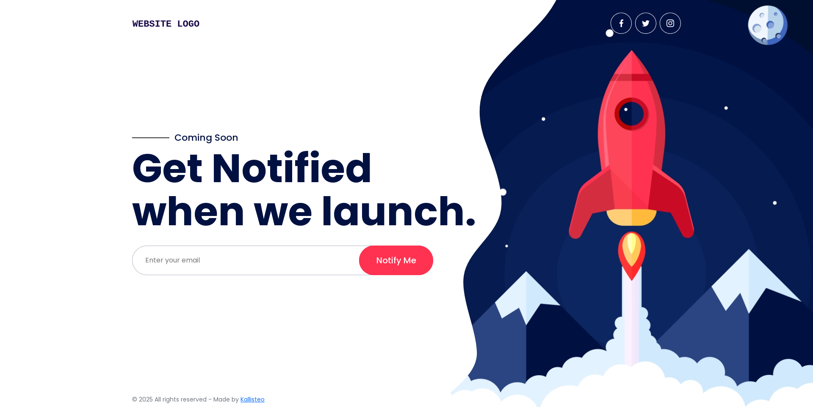

# Coming Soon HTML Template

A **minimal, elegant, and responsive “Coming Soon” landing page** built with **HTML5**, **CSS3**, and **Bootstrap 5**. Perfect for startups, agencies, and personal projects preparing for launch.



* * *

## Features

* **Clean & Modern Layout** – minimal design focused on clarity and anticipation
* **Fully Responsive** – adapts beautifully to all devices
* **Launch Teaser Section** – highlight your upcoming release with engaging visuals
* **Newsletter Form** – collect user emails for launch notifications
* **Social Media Icons** – SVG-based, lightweight and scalable
* **Easy Customization** – simple structure and well-commented code

* * *

## Structure

```
coming-soon-template/
│
├── index.html
├── assets/
│   ├── css/
│   │   ├── vendor/
│   │   │   └── bootstrap.min.css
│   │   └── main.css
│   ├── src/
│   │   └── images/
│   │       ├── bg.jpg
│   │       ├── xs.jpg
│   │       └── logo.png
└── README.md
```

* * *

## Quick Start

1. **Clone or Download** this repository:

   ```bash
   git clone https://github.com/neoslabx/coming-soon.git
   ```
2. **Open `index.html`** in your browser to preview.
3. **Customize your content**:

   * Replace `logo.png`, `bg.jpg`, and `xs.jpg` in `/assets/src/images/`.
   * Edit titles, headings, and links inside `index.html`.
   * Modify styles in `assets/css/main.css`.

* * *

## Newsletter Integration

The template includes a sample newsletter form:

```html
<form action="#">
  <input type="email" placeholder="Enter your email">
  <button type="submit">Notify Me</button>
</form>
```

To make it functional:

* Connect to your preferred service (e.g., Mailchimp, Sendinblue, Formspree).
* Update the `action` attribute with your form endpoint.

* * *

## Customization Tips

* Change the background image URL in the `<section class="main">` inline style.
* Adjust typography, colors, and spacing in `main.css`.
* Add animation effects or countdown scripts if desired.

* * *

## Dependencies

* [Bootstrap 5](https://getbootstrap.com/) – responsive grid and UI components
* Custom CSS (`assets/css/main.css`)

*(No JavaScript dependency by default — fully functional with pure HTML/CSS.)*


* * *

## Browser Support

* Chrome
* Firefox
* Safari
* Edge
* Opera

* * *

## Contributing

Contributions are welcome! Please follow these steps:

1. Fork the repository.
2. Create a new branch (`git checkout -b feature/your-feature`).
3. Make your changes and commit them (`git commit -m "Add your feature"`).
4. Push to your branch (`git push origin feature/your-feature`).
5. Open a pull request with a clear description of your changes.

Ensure your code follows PEP 8 style guidelines and includes appropriate tests.

* * *

## License

This project is licensed under the MIT License. See the [LICENSE](LICENSE) file for details.

* * *

## Contact

For any issues, suggestions, or questions regarding the project, please open a new issue on the official GitHub repository or reach out directly to the maintainer through the [GitHub Issues](issues) page for further assistance and follow-up.